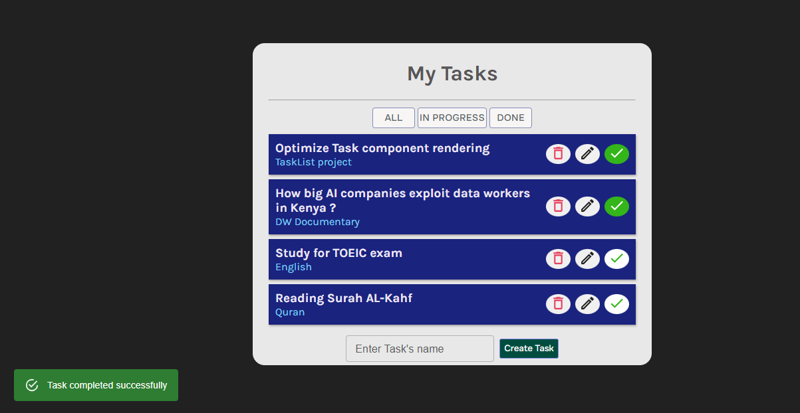
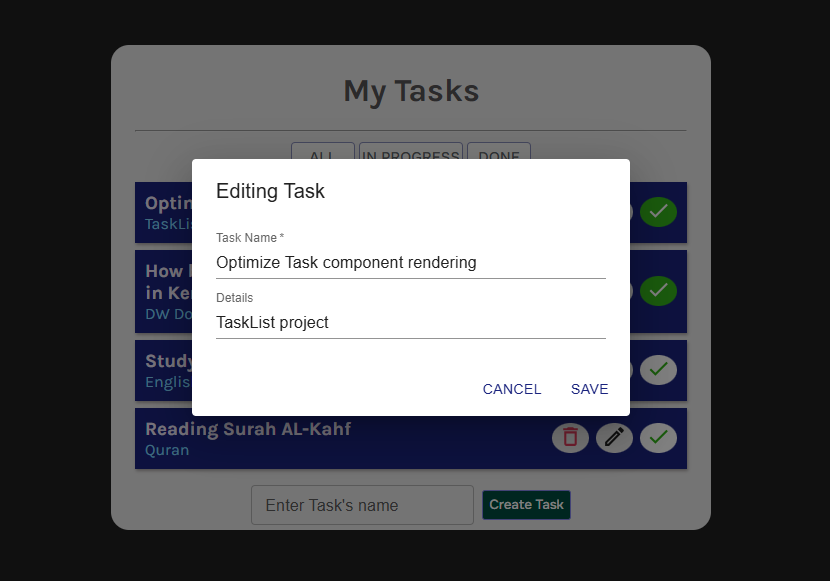

# Task List

A React application that implements CRUD operations for task management.

## Project Goal

The primary goal of this project is to gain a deeper understanding of React Hooks and learn how to use them effectively in real-world applications.

The project follows React best practices, including:

- Maintaining a single source of truth for state management.
- Optimizing component rendering and minimizing unnecessary re-renders.
- Lifting shared state and UI logic to parent components when appropriate (e.g., Snackbar notifications).
- Using `useMemo` for performance optimization.
- Using `useReducer` for scalable and maintainable state management.
- Building reusable and well-structured components.

## Features

- Add a task
- Edit a task
- Delete a task
- Mark a task as completed
- View completed tasks

## Future Enhancements

### Database Integration

- Integrate a database to persist user tasks.
- Allow users to access their tasks across sessions and devices.

### AI Assistant

- Add an AI-powered assistant to help users manage and accomplish their tasks.
- Generate task suggestions and productivity recommendations.
- Provide smart prioritization and scheduling assistance.

## Technologies

- React
- JavaScript
- Material UI
- React Hooks (`useState`, `useReducer`, `useMemo`, etc.)

## Learning Outcomes

Through this project, I aim to strengthen my understanding of:

- React Hooks
- State management patterns
- Component communication
- Performance optimization
- Clean architecture and React best practices




## Clone the repository :

```bash
git clone https://github.com/samirfandi/TaskList.git
```

## Go to the project folder :

```bash
cd task-list
```

## 📦 Install dependencies :

```bash
npm install
```

## 🚀 Run the Project

```bash
npm run dev
```
